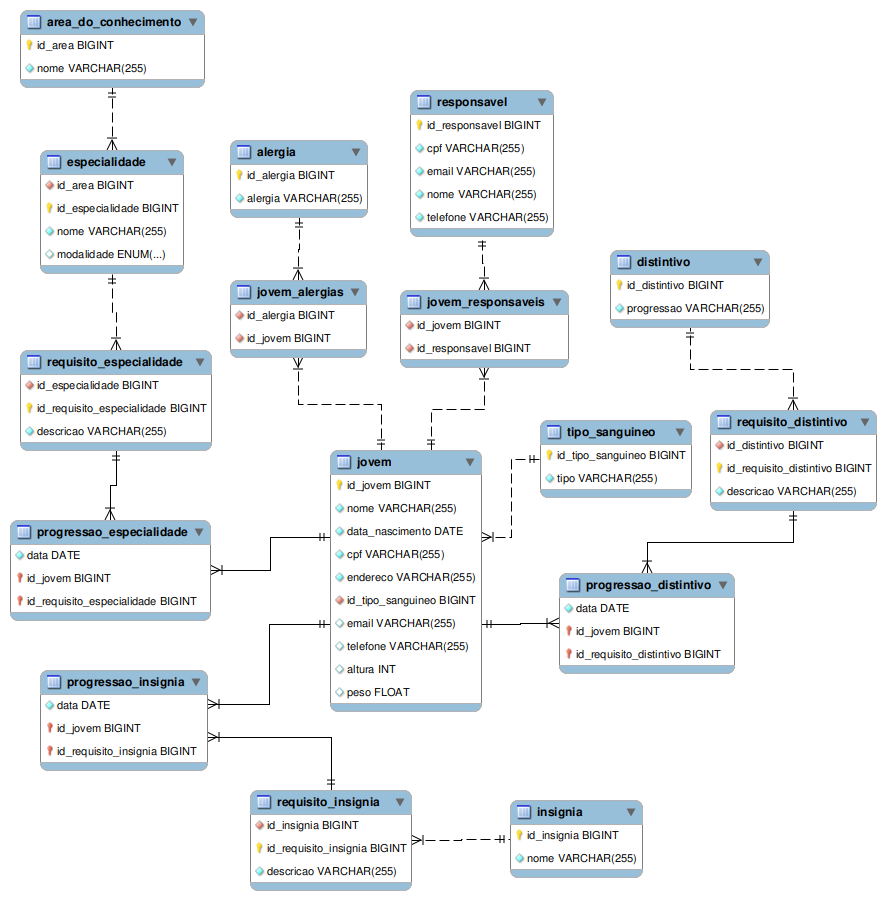

# Projeto Final - Banco de Dados

- Aluno: Andrey Adriano da Rosa
- Professor: Emerson Ribeiro de Mello
- Semestre: 2023.02

## Registro de progressões no movimento escoteiro: ramo lobinho

    Descrição e requisitos do projeto disponíveis na raiz do repositório.

### Modelo criado no MySQL Workbench

## Funcionalidades da aplicação:

### Implementadas:
- Cadastrar jovem
- Registrar progressão de um jovem para uma especialidade
- Visualizar dados biográficos de um jovem
- Visualizar especialidades e insígnias de um jovem
- Visualizar jovens que possuem uma determinada especialidade

### Não implementadas:
- Registrar progressão de um jovem para uma insígnia ou distintivo
- Visualizar requisitos já cumpridos por um determinado jovem para uma determinada especialidade
- Visualizar jovens que possuem todos os requisitos para obter o Cruzeiro do Sul

## Instruções de uso:

- Antes de executar a aplicação, configure corretamente as informações do banco de dados no arquivo application.properties.
- O banco de dados é povoado com a aplicação Java, portanto é necessário rodar inicialmente com a propriedade ddl-auto=create e com a linha 91 (this.povoarBanco) do arquivo LobinhoRunner.java descomentada.
- Após a aplicação povoar o banco, você deve comentar a linha mencionada e, caso queira que as modificações não sejam perdidas, definir a propriedade ddl-auto=none e reiniciar a aplicação

## Dados do banco

### Jovens disponíveis

| CPF | nome |
| :-- | :--- |
| 609.475.479-40 | Bruno Kevin Jesus |
| 111.222.333-44 | Arlindo Cruz |
| 123.456.789-10 | Ada Lovelace |
| 321.456.987-11 | Alan Turing |

Note que apenas o jovem "Bruno Kevin Jesus" possui progressões cadastradas (ele possui todas). O restante dos jovens não possui nenhuma.

### Responsáveis disponíveis:
| CPF | nome |
| :-- | :--- |
| 491.979.710-90 | Nicolas Severino da Cruz |
| 016.005.900-39 | Raul Julio Bruno Alves |
| 213.118.798-03 | Osvaldo Kaique Hugo Rezende |
| 828.107.861-86 | Beatriz Hadassa Manuela Silveira |
| 864.292.258-36 | Luzia Alessandra Novaes |
| 150.579.862-01 | Caroline Eduarda Benedita Farias |

### Alergias disponíveis:
| Alergia |
| :--- |
| Leite |
| Ovo |
| Rinite alérgica |
| Picada de Aranha |

## Menus

### Menu principal

Ao iniciar a aplicação, serão disponibilizadas as seguintes opções:

    ##-- Aplicação Escoteiros Ramo Lobinho --##
    1 - Registrar dados
    2 - Gerar relatório

Tenha em mente que o usuário deve digitar apenas números para selecionar uma opção, do contrário a aplicação falhará. 

#### Submenu registrar dados

A opção 1 leva a um submenu:

    ##-- Registrar dados --##
    1. Cadastrar jovem
    2. Alterar dados de um jovem
    3. Cadastrar requisito cumprido para um jovem

A opção 2 do submenu acima não se encontra disponível.

A opção 3 permite cadastrar a progressão de um jovem em uma determinada especialidade.

#### Submenu gerar relatório

A opção 2 do menu principal leva a outro submenu:

    ##-- Gerar relatório --##
    1. Visualizar dados de um jovem
    2. Visualizar especialidades e insignias de um jovem
    3. Visualizar jovens que possuem uma determinada especialidade
    4. Visualizar requisitos já cumpridos por um determinado jovem para uma determinada especialidade
    5. Visualizar jovens que possuem todos requisitos para obter o Cruzeiro do Sul

As opções 4 e 5 não estão disponíveis.

## Exemplos

Os exemplos abaixo demonstram como utilizar as funcionalidades da aplicação.

### Cadastrando um jovem

Ao selecionar a opção "Cadastrar jovem", serão pedidas algumas informações:

- Nome
- Data de nascimento (formato YYYY-MM-DD)
- CPF
- Endereço
- Tipo sanguíneo válido (A+, B+, etc...)
- CPF dos responsáveis (necessário que o responsável já esteja cadastrado)
- Alergias (leite, ovo... ou pode deixar o campo vazio se não quiser nenhuma)

Para inserir o CPF dos responsáveis, você pode digitar por exemplo:

    491.979.710-90,864.292.258-36
    
Para inserir as alergias, você pode digitar:

    leite,ovo

### Registrando progressão em uma especialidade de um jovem

Ao selecionar a opção "Cadastrar requisito cumprido para um jovem", selecione a opção "Cadastrar requisito de especialidade cumprido", então serão pedidas algumas informações:

- CPF do jovem
- Especialidade desejada (deve ser selecionado da lista apresentada)
- Requisito desejado (deve ser selecionado da lista apresentada)
- Data em que o requisito foi cumprido (formato YYYY-MM-DD)

Você pode seguir o exemplo:

    CPF: 111.222.333-44
    Selecione a especialidade número 1 (Criptografia)
    Selecione o requisito 3
    Data: 2020-06-05

### Visualizar dados de um jovem

Após selecionar a opção "Visualizar dados de um jovem", basta digitar o CPF de um jovem cadastrado para visualizar seus dados biográficos, responsáveis e alergias.

Por exemplo:

### Visualizar especialidades e insignias de um jovem

Após selecionar a opção "Visualizar especialidades e insignias de um jovem", basta digitar o CPF de um jovem cadastrado para visualizar suas especialidades e insígnias.

###  Visualizar jovens que possuem uma determinada especialidade

Após selecionar a opção "Visualizar jovens que possuem uma determinada especialidade", basta selecionar uma das especialidades.

OBS: Apenas o lobinho "Bruno Kevin Jesus" possui especialidades.
